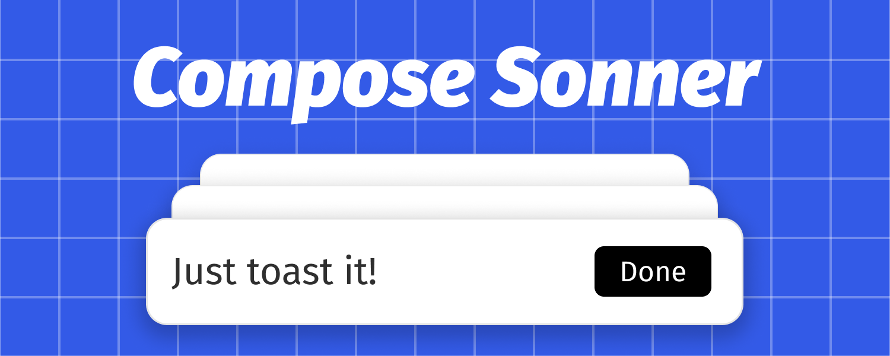

<div align="center">
  
  <h1>Compose Sonner</h1>
  
  
</div>

> An opinionated toast component for Compose Multiplatform.

This is a Compose implementation of [sonner](https://github.com/emilkowalski/sonner) - an excellent toast library by [emilkowalski](https://github.com/emilkowalski).

### Demo

WasmJs Demo

[https://dokar3.github.io/compose-sonner/](https://dokar3.github.io/compose-sonner/)

Video

https://github.com/dokar3/compose-sonner/assets/68095777/ff97c6cc-012e-4152-8c40-0d2ba382c757

### Features

- Almost the same as emilkowalski's React implementation: UI, Animations, and even the API.
  These include:
    - Stacked toasts and expanded toasts
    - Different types and rich colors
    - Transitions
    - Positions (Alignments)
    - Swipe down to dismiss
    - Close button and action button
    - Custom icons
    - Durations
- Lazy and performant, you can display a large amount of toasts at once
- Fully customizable, you can render your own Composable on it
- Supports both Material 2 and Material 3 because it does not depend on them

### Roadmaps

- [x] iOS target. Done in [#8](https://github.com/dokar3/compose-sonner/pull/8), thanks to [@shubhamsinghshubham777](https://github.com/shubhamsinghshubham777)!
- [x] Online wasmJs sample

# Usages

### Installation

build.gradle(.kts)

```kotlin
implementation("io.github.dokar3:sonner:<VERSION>")
```

libs.versions.toml

```toml
sonner = { module = "io.github.dokar3:sonner", version = "<VERSION>" }
```

### Basic

```kotlin
val toaster = rememberToasterState()

Button(onClick = { toaster.show("Hello world!") }) {
    Text("Show a toast")
}

Toaster(state = toaster)
```

### Types

```kotlin
toaster.show(
    message = "Message",
    type = ToastType.[Normal | Success | Info | Warning | Error],
)
```

### Dark theme

```kotlin
toaster.show(
    message = "Message",
    darkTheme = true,
)
```

### Positions

```kotlin
Toaster(
    state = toaster,
    alignment = Alignment.[TopStart | TopCenter | TopEnd | BottomStart | BottomCener | BottomEnd],
)
```

### Durations

```kotlin
toaster.show(
    message = "Message",
    duration = [ToasterDefaults.DurationLong | 5000.milliseconds | Duration.INFINITE],
)
```

### Updates

```kotlin
const val TOAST_ID_LOADING = ANYTHING

toaster.show(message = "Loading", id = TOAST_ID_LOADING, duration = Duration.INFINITE)

toaster.show(message = "Success", id = TOAST_ID_LOADING)
```

### Dismiss

```kotlin
toaster.dismiss(id)
toaster.dismiss(toast)
toaster.dismissAll()
```

### Buttons

```kotlin
// Enable close buttons
Toaster(
    state = toaster,
    showCloseButton = true,
)

// Set an action button
toaster.show(
    message = "Message",
    action = TextToastAction(
        text = "Dismiss",
        onClick = { toaster.dismiss(it) },
    )
)
```

### Icons

```kotlin
Toaster(
    state = toaster,
    iconSlot = { toast ->
        // ICON_LOADING can be anything, it's just a mark
        if (toast.icon == ICON_LAODING) {
            LoadingIcon()
        } else {
            // Fallback to the default icon slot
            ToasterDefaults.iconSlot(toast)
        }
    },
)
```

### Dismiss pause

```kotlin
Toaster(
    state = toaster,
    dismissPause = ToastDismissPause.[Never | OnNotFront | OnInvisible],
)
```

### Other

```kotlin
@Composable
fun Toaster(
    contentColor: @Composable (toast: Toast) -> Color,
    border: @Composable (toast: Toast) -> BorderStroke,
    background: @Composable (toast: Toast) -> Brush,
    shape: @Composable (toast: Toast) -> Shape,
    elevation: Dp,
    shadowAmbientColor: Color,
    shadowSpotColor: Color,
    contentPadding: PaddingValues,
    containerPadding: @Composable (toast: Toast) -> PaddingValues,
    widthPolicy: @Composable (toast: Toast) -> ToastWidthPolicy,
    offset: IntOffet,
)
```

### Interact with ViewModel UiState

Define the mapping function

```kotlin
fun UiMessage.toToast(): Toast = when (this) {
    is UiMessage.Error -> Toast(id = id, message = message, type = ToastType.Error)
    is UiMessage.Success -> Toast(id = id, message = message, type = ToastType.Success)
}
```

Then

```kotlin
val toaster = rememberToasterState(
    onDismissed = { viewModel.removeUiMessageById(it.id as Long) },
)

val uiState by viewModel.uiState.collectAsState()

LaunchedEffect(viewModel, toaster) {
    // Listen to messages changes and map to toasts
    val toastsFlow = viewModel.uiState.map { it.uiMessages.map(UiMessage::toToast) }
    toaster.listenMany(toastsFlow)
}

Toaster(state = toaster)
```

Or use an adapter function

```kotlin
@Composable
fun UiMessageToaster(
    messages: List<UiMessage>,
    onRemoveMessage: (id: Long) -> Unit,
    modifier: Modifier = Modifier,
) {
    val toaster = rememberToasterState(
        onToastDismissed = { onRemoveMessage(it.id as Long) },
    )

    val currentMessages by rememberUpdatedState(messages)

    LaunchedEffect(toaster) {
        // Listen to State<List<UiMessage>> changes and map to toasts
        toaster.listenMany { currentMessages.map(UiMessage::toToast) }
    }

    Toaster(state = toaster, modifier = modifier)
}

@Composable
fun YourScreen(...) {
    val uiState by viewModel.uiState.collectAsState()

    ...

    UiMessageToaster(
        messages = uiState.uiMessages,
        onRemoveMessage = { viewModel.removeUiMessageById(it) },
    )
}
```

# License

```
Copyright 2024 dokar3

Licensed under the Apache License, Version 2.0 (the "License");
you may not use this file except in compliance with the License.
You may obtain a copy of the License at

    http://www.apache.org/licenses/LICENSE-2.0

Unless required by applicable law or agreed to in writing, software
distributed under the License is distributed on an "AS IS" BASIS,
WITHOUT WARRANTIES OR CONDITIONS OF ANY KIND, either express or implied.
See the License for the specific language governing permissions and
limitations under the License.
```
